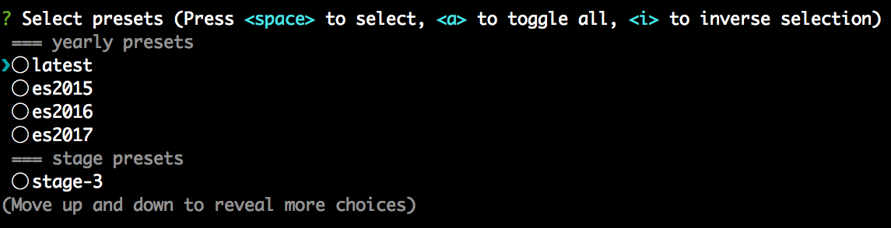

# babel-init

[](https://travis-ci.org/abouthiroppy/babel-init)
<!-- codecov https://codecov.io/gh -->
<!-- npm version badge: https://badge.fury.io/ -->

Setup `.babelrc` using command.

## Install
```sh
$ npm install -g babel-init
```

## Usage
```sh
$ npm init --yes #if you havn't made package.json
$ babel-init

Select presets and plugins!
```


Plugin List: https://babeljs.io/docs/plugins/

### output

```sh
? Select presets latest, stage-0
? Select plugins syntax-flow and transform-flow-strip-types
```
`.babelrc`
```json
{
  "env": {},
  "ignore": [],
  "plugins": [
    "syntax-flow",
    "transform-flow-strip-types"
  ],
  "presets": [
    "latest",
    "stage-0"
  ]
}
```

## Customize
### .babelinitrc
You can use `.babelinitrc`.  
You put it on home or project root directory.  
babel-init read this files and creating the select box.

```json
{
  "presets": [],
  "plugins": []
}
```

The following is a sample file.
```json
{
  "presets": [],
  "plugins": [
    {
      "name": "syntax-flow and transform-flow-strip-types",
      "value": "syntax-flow,transform-flow-strip-types"
    },
    "lodash",
    "transform-runtime"
  ]
}
```
`name` is the words displayed in the select box.  
`value` is an installed package name. (same meaning as only string in array)
